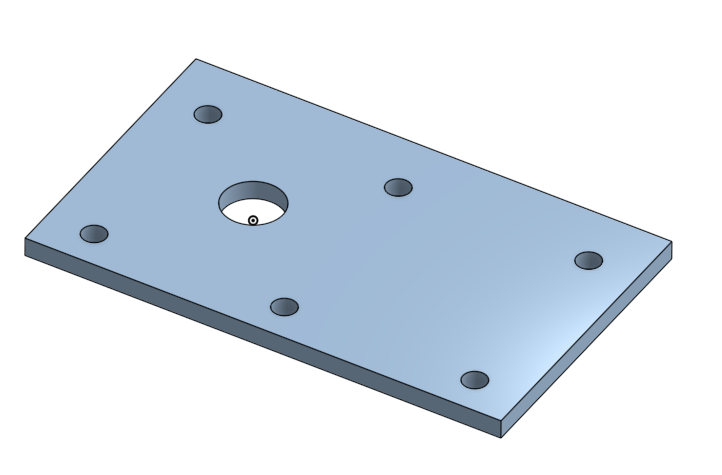
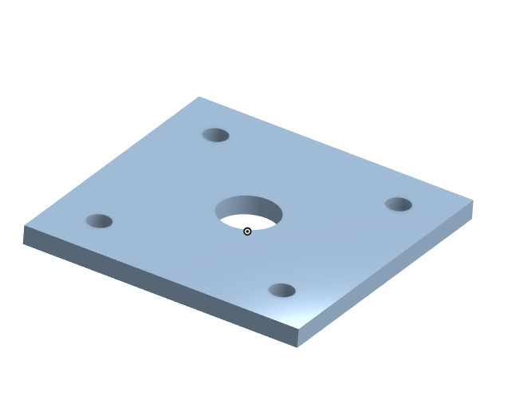
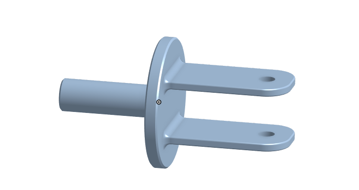
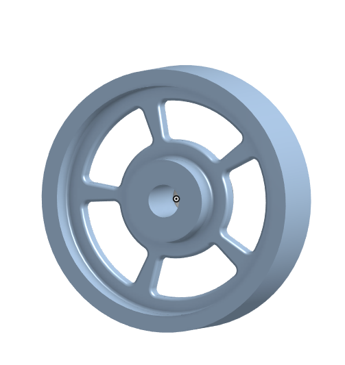
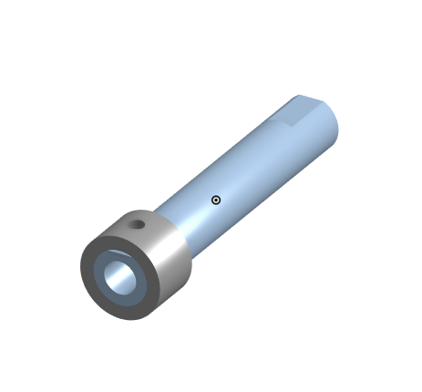
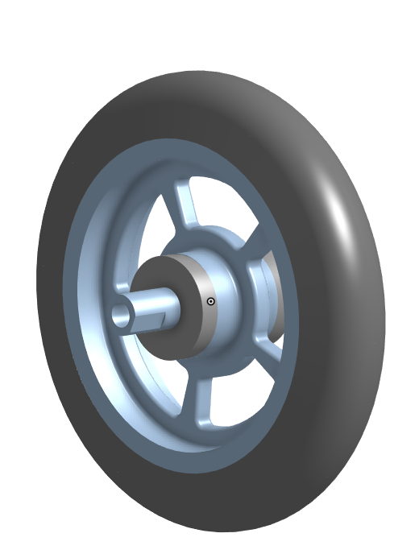
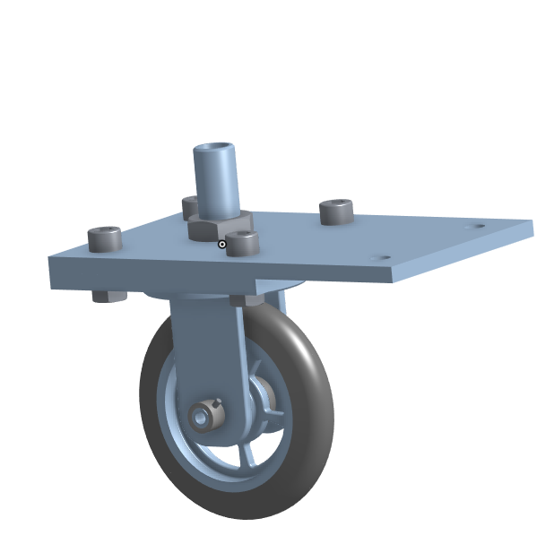

# Basic_Onshape_CAD

I made a base for a caster

I made an extruded rectangle with dimensions of 200mm by 120mm and cut 6 holes in it evenly spaced 10mm circumfrance and one big hole around the origin.

I made a mount for a caster

I made an extruded square that was 120mm by 120mm with evenly cut holes and one big hole in the middle like a square version of the base.
 

I made a fork for the caster

I made an extruded cicrle with two equal sized filleted rectagles with holes in the top middle of them as well as a hollow cylindar on the opposite side of the circle

I made a tyre for the caster

I made an equal trapazoid by making ist then making it symmetrical, then instead of extruding it I revolved it around the x axis then filleted the edges to make it more round

I made a wheel for the caster

I made an I shape with the sketch tool then used the revolve buttopn to make it more wheel like then fillet the edges to make it curved

I made and axle and collar for the caster

I made a hollow cylindar with symetric indents on each side then another bigger cylindar over one side with a hole in it

I made the subassembly for the caster

I first inserted the wheel and tyre then mated them together then mated the collar to the middle then put bearings on either side

I finished the final assembly for the caster

I first mated the base and the mount togetrher followed by revlove mating the fork then putting the subassembly inbetween the fork with additional bearings then put in the last screws 

I made a picture frame with dowels

I started by making dowel pins by chafuring a cylindar then making configurations with size and length, then I made the picture frame by making a trapazoid that is 10 inches long and one that is 8 inches long.

