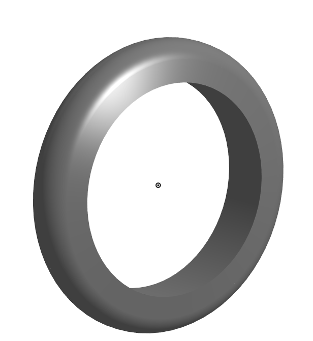

# Basic_Onshape_CAD

I made a base for a caster

I made an extruded rectangle with dimensions of 200mm by 120mm and cut 6 holes in it evenly spaced 10mm circumfrance and one big hole around the origin.

I made a mount for a caster

I made an extruded square that was 120mm by 120mm with evenly cut holes and one big hole in the middle like a square version of the base.
 

I made a fork for the caster

I made an extruded cicrle with two equal sized filleted rectagles with holes in the top middle of them as well as a hollow cylindar on the opposite side of the circle

I made a tyre for the caster

I made an equal trapazoid by making ist then making it symmetrical, then instead of extruding it I revolved it around the x axis then filleted the edges to make it more round

